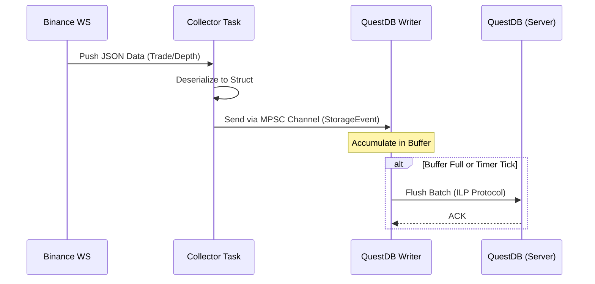
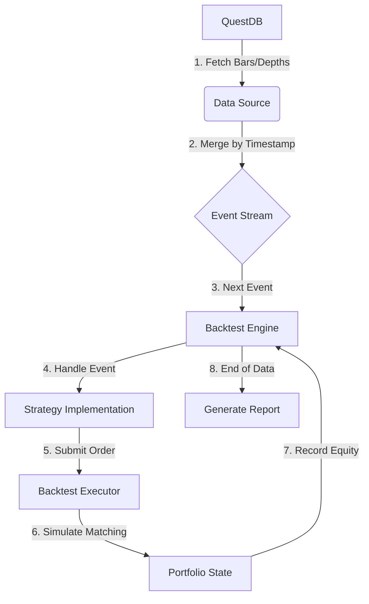

# 03. 데이터 흐름 분석

이 문서는 `trading-bot`에서 발생하는 핵심 유즈케이스의 데이터 흐름을 단계별로 추적하고 시각화합니다.

## 1. 실시간 데이터 수집 흐름 (Collector Flow)

바이낸스 등의 외부 소스로부터 데이터를 가져와 QuestDB에 저장하기까지의 과정입니다.

### 단계별 흐름
1. **Source**: 바이낸스 WebSocket 서버로부터 JSON 형태의 데이터(Trade, Depth 등)가 수신됩니다.
2. **Parser**: `market_data` 모듈에서 JSON을 강타입 구조체(`StreamData`)로 역직렬화합니다.
3. **Dispatch**: 수집된 데이터는 `mpsc::channel`을 통해 중앙 `StorageEvent` 채널로 전송됩니다.
4. **Buffering**: `storage::questdb::writer` 태스크가 채널에서 데이터를 읽어 내부 메모리 버퍼에 쌓습니다.
5. **Flush**: 설정된 임계치(예: 1000개 로우 또는 100ms 경과)에 도달하면 QuestDB 서버로 배치를 한 번에 전송합니다.

### 시각화 (Sequence Diagram)

## 2. 백테스팅 실행 흐름 (Backtest Flow)

과거 데이터를 불러와 전략을 시뮬레이션하고 결과를 도출하는 과정입니다.

### 단계별 흐름
1. **Query**: `backtest` 바이너리가 지정된 기간과 심볼에 대해 QuestDB에 REST API로 데이터를 요청합니다.
2. **Load**: `Bar`(캔들)와 `Depth`(호가) 데이터를 비동기로 동시에 가져옵니다.
3. **Merge**: 서로 다른 두 데이터 소스를 타임스탬프 순서로 병합하여 하나의 `Event` 스트림을 만듭니다.
4. **Execution Loop**:
    - **Strategy Trigger**: 각 이벤트마다 `on_bar` 또는 `on_depth` 핸들러가 호출됩니다.
    - **Order Submission**: 전략 로직에 따라 `executor.submit()`을 통해 주문이 접수됩니다.
    - **Matching**: 백테스트 엔진이 주문 접수 시점 이후의 가장 가까운 호가 데이터를 확인하여 체결 여부를 결정합니다.
5. **Report**: 모든 데이터 처리가 끝나면 포트폴리오 수익률, 승률, 최대 낙폭(MDD) 등을 계산하여 파일로 저장합니다.

### 시각화 (Flowchart)

---
[메인으로 돌아가기](./README.md) | [04. 기술 스택 및 아키텍처](./04_tech_stack_architecture.md)
