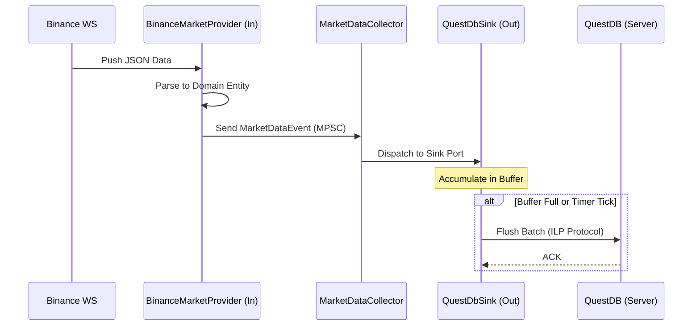
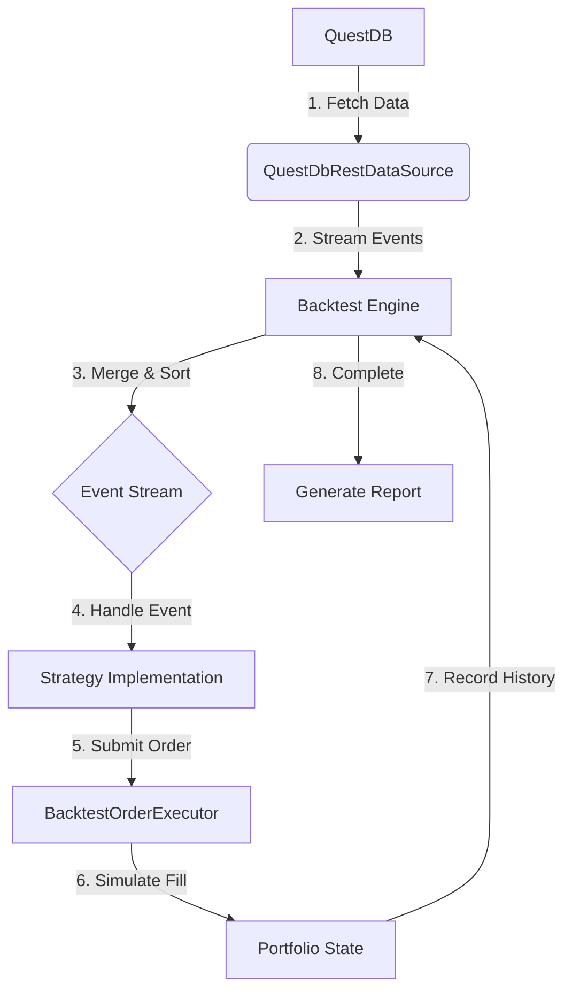
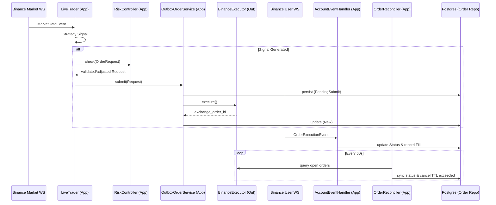

# 03. 데이터 흐름 분석

이 문서는 `trading-bot`에서 발생하는 핵심 유즈케이스의 데이터 흐름을 헥사고날 아키텍처 관점에서 추적하고 시각화합니다.

## 1. 실시간 데이터 수집 흐름 (Collector Flow)

외부 거래소(Binance 등)로부터 데이터를 수집하여 QuestDB에 저장하기까지의 과정입니다.

### 단계별 흐름
1. **Source (External)**: 바이낸스 WebSocket 서버로부터 데이터가 수신됩니다.
2. **Inbound Adapter (Binance Market Provider)**: 수신된 JSON을 도메인 엔티티(`Trade`, `Depth` 등)로 파싱합니다.
3. **Inbound Port (MarketDataProvider)**: 파싱된 데이터를 `MarketDataEvent` 채널로 전송합니다.
4. **Application Service (MarketDataCollector)**: 이벤트를 수신하여 필요한 처리를 거친 후 아웃바운드 포트로 전달합니다.
5. **Outbound Port (MarketDataSink)**: 데이터를 저장소로 보낼 준비를 합니다.
6. **Outbound Adapter (QuestDbSink)**: `mpsc` 채널 버퍼링을 거쳐 QuestDB에 배치(Batch)로 저장합니다.

### 시각화 (Sequence Diagram)

```mermaid
sequenceDiagram
    participant B as Binance WS
    participant BA as BinanceMarketProvider (In)
    participant C as MarketDataCollector
    participant QA as QuestDbSink (Out)
    participant Q as QuestDB (Server)

    B->>BA: Push JSON Data
    BA->>BA: Parse to Domain Entity
    BA->>C: Send MarketDataEvent (MPSC)
    C->>QA: Dispatch to Sink Port
    Note over QA: Accumulate in Buffer
    alt Buffer Full or Timer Tick
        QA->>Q: Flush Batch (ILP Protocol)
        Q-->>QA: ACK
    end
```

## 2. 백테스팅 실행 흐름 (Backtest Flow)

과거 데이터를 불러와 전략을 시뮬레이션하고 결과를 도출하는 과정입니다.

### 단계별 흐름
1. **Outbound Port (MarketDataSource)**: `application/backtest` 엔진이 지정된 기간의 데이터를 요청합니다.
2. **Outbound Adapter (QuestDbRestDataSource)**: QuestDB로부터 과거 데이터를 인출(Fetch)합니다.
3. **Application Service (Backtest Engine)**:
    - **Merge**: 여러 데이터 소스를 타임스탬프 순으로 병합하여 통합 이벤트 스트림을 생성합니다.
    - **Execution**: 각 이벤트마다 `Strategy` 핸들러를 호출합니다.
4. **Domain Logic (Strategy)**: 시장 데이터를 분석하여 주문(`OrderRequest`)을 생성합니다.
5. **Outbound Port (OrderExecutor)**: 주문을 제출합니다. 백테스트 환경에서는 `BacktestOrderExecutor`가 이를 처리합니다.
6. **Report Generation**: 시뮬레이션 종료 후 수익률, MDD 등을 계산하여 리포트를 생성합니다.

### 시각화 (Flowchart)

```mermaid
flowchart TD
    A[QuestDB] --"1. Fetch Data"--> B(QuestDbRestDataSource)
    B --"2. Stream Events"--> C[Backtest Engine]
    C --"3. Merge & Sort"--> D{Event Stream}
    D --"4. Handle Event"--> E[Strategy Implementation]
    E --"5. Submit Order"--> F[BacktestOrderExecutor]
    F --"6. Simulate Fill"--> G[Portfolio State]
    G --"7. Record History"--> C
    C --"8. Complete"--> H[Generate Report]
```

## 3. 실시간 트레이딩 흐름 (Trader Flow)

실제 시장에서 전략에 따라 주문을 실행하고, 리스크 검증 및 상태 동기화가 이루어지는 과정입니다.

### 단계별 흐름
1. **Market Feed**: `BinanceMarketProvider`를 통해 실시간 `MarketDataEvent`를 수신합니다.
2. **Strategy Analysis**: `LiveTrader`가 시장 데이터를 전략에 전달하여 매매 신호를 판단합니다.
3. **Pre-trade Risk Check**: 신호 발생 시 `RiskController`가 계좌 잔고, 포지션 한도, 거래소 필터를 검증합니다. 한도 초과 시 수량을 자동 조정합니다.
4. **Order Submission (Outbox)**: `OutboxOrderService`가 주문을 DB에 `PendingSubmit` 상태로 먼저 기록한 후, `BinanceOrderExecutor`를 통해 거래소에 제출합니다.
5. **Execution Event**: 거래소 체결 시 `BinanceUserStreamHandler`가 이벤트를 수신하여 `AccountEventHandler`에 전달합니다.
6. **Background Sync**: 
    - `OrderReconciler`가 주기적으로 미체결 주문과 로컬 DB 간의 차이를 동기화합니다.
    - `AccountStateRefresher`와 `ExchangeInfoRefresher`가 잔고 및 시장 규칙을 주기적으로 갱신합니다.

### 시각화 (Sequence Diagram)

```mermaid
sequenceDiagram
    participant MWS as Binance Market WS
    participant T as LiveTrader (App)
    participant RC as RiskController (App)
    participant OS as OutboxOrderService (App)
    participant BE as BinanceExecutor (Out)
    participant UWS as Binance User WS
    participant AEH as AccountEventHandler (App)
    participant OR as OrderReconciler (App)
    participant DB as Postgres (Order Repo)

    MWS->>T: MarketDataEvent
    T->>T: Strategy Signal
    alt Signal Generated
        T->>RC: check(OrderRequest)
        RC-->>T: validated/adjusted Request
        T->>OS: submit(Request)
        OS->>DB: persist (PendingSubmit)
        OS->>BE: execute()
        BE-->>OS: exchange_order_id
        OS->>DB: update (New)
    end
    UWS->>AEH: OrderExecutionEvent
    AEH->>DB: update Status & record Fill
    loop Every 60s
        OR->>BE: query open orders
        OR->>DB: sync status & cancel TTL exceeded
    end
```

---
[메인으로 돌아가기](./README.md) | [04. 기술 스택 및 아키텍처](./04_tech_stack_architecture.md)
